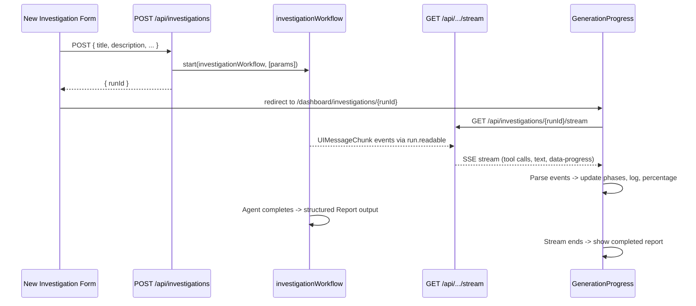

# Phase 1: Durable Agent Vertical Slice

## Goal

Replace the mock form submission with a real end-to-end flow: **form -> POST API -> DurableAgent workflow -> streamed progress -> rendered report**.

## Architecture




## Dependencies to Install

- `workflow` -- core Workflow DevKit runtime (durable workflows, steps)
- `@workflow/ai` -- DurableAgent, `Output` helpers
- `@ai-sdk/openai` -- OpenAI provider (uses `OPENAI_API_KEY` from `.env.local`)

```bash
bun add workflow @workflow/ai @ai-sdk/openai
```

## New Files

### 1. `lib/report-schema.ts` -- Zod schema for structured output

A Zod schema mirroring the existing `Report` type from `[lib/types.ts](lib/types.ts)`. Used with `Output.object({ schema })` on the DurableAgent so the final response is a valid `Report`.

```typescript
import { z } from "zod";

export const reportSchema = z.object({
  title: z.string(),
  summary: z.string(),
  executiveSummary: z.string(),
  tags: z.array(z.string()),
  stakeholders: z.array(z.object({
    name: z.string(),
    role: z.string(),
    incentives: z.array(z.string()),
    confidence: z.enum(["high", "medium", "low"]),
  })),
  motivations: z.array(z.object({
    title: z.string(),
    summary: z.string(),
    confidence: z.enum(["high", "medium", "low"]),
    supportingEvidence: z.array(z.string()),
  })),
  evidence: z.array(z.object({
    claim: z.string(),
    source: z.string(),
    sourceUrl: z.string(),
    confidence: z.enum(["high", "medium", "low"]),
  })),
  assumptions: z.array(z.string()),
  limitations: z.array(z.string()),
  alternativeExplanations: z.array(z.string()),
});
```

### 2. `workflows/investigation/steps/research.ts` -- Durable step wrappers

Each wrapper is a named `async function` with `"use step"` that calls the existing API clients from `lib/`. They also emit `data-progress` chunks to the run's writable stream for live UI updates.

Key pattern (from Workflow DevKit [streaming docs](https://useworkflow.dev/docs/foundations/streaming)):

```typescript
import { getWritable } from "workflow";
import type { UIMessageChunk } from "ai";
import { braveWebSearch } from "@/lib/brave-search";

export async function braveWebSearchStep(input: BraveSearchParams) {
  "use step";

  const writable = getWritable<UIMessageChunk>();
  const writer = writable.getWriter();
  await writer.write({
    type: "data",
    data: [{ phase: "gathering-sources", message: `Searching: ${input.q}` }],
  });
  writer.releaseLock();

  return braveWebSearch(input);
}
```

Create step wrappers for all 7 tools: `braveWebSearchStep`, `firecrawlScrapeStep`, `firecrawlSearchStep`, `gdeltTopMediaEventsStep`, `newsTopHeadlinesStep`, `newsEverythingStep`, `newsSourcesStep`.

### 3. `workflows/investigation/workflow.ts` -- Main investigation workflow

The core `"use workflow"` function that creates a `DurableAgent` with research tools and streams the investigation.

Key design decisions:

- **Model**: `openai("gpt-4.1")` via `@ai-sdk/openai` (1M context, $2/$8 per 1M tokens, strong at instruction following and structured output)
- **Tools**: New tool definitions referencing the step wrapper functions from `steps/research.ts`
- **Structured output**: `experimental_output: Output.object({ schema: reportSchema })` to produce a valid `Report`
- **maxSteps**: 30 (allows ~15 tool calls with intermediate reasoning)

The agent system prompt instructs it to:

1. Research the topic using the available tools
2. Identify stakeholders and their incentives
3. Formulate motivation hypotheses with evidence
4. Assess confidence levels, assumptions, and limitations
5. Produce a structured report as the final output

### 4. `app/api/investigations/route.ts` -- POST route handler

Starts the workflow and returns the `runId`:

```typescript
import { start } from "workflow/api";
import { investigationWorkflow } from "@/workflows/investigation/workflow";

export async function POST(req: Request) {
  const params = await req.json();
  const run = await start(investigationWorkflow, [params]);
  return Response.json({ runId: run.id });
}
```

### 5. `app/api/investigations/[runId]/stream/route.ts` -- GET stream reconnection

Returns a resumable stream using `createUIMessageStreamResponse`:

```typescript
import { createUIMessageStreamResponse } from "ai";
import { getRun } from "workflow/api";

export async function GET(req: Request, { params }) {
  const { runId } = await params;
  const startIndex = parseInt(new URL(req.url).searchParams.get("startIndex") ?? "0", 10);
  const run = getRun(runId);
  return createUIMessageStreamResponse({
    stream: run.getReadable({ startIndex }),
  });
}
```

### 6. `hooks/use-investigation-stream.ts` -- Custom stream consumer hook

A React hook that connects to the stream endpoint and parses `UIMessageChunk` events into progress state. Uses `readUIMessageStream` from the `ai` package (already installed).

Returns: `{ messages, activityLog, currentPhase, percentage, isComplete, error }`

Maps stream events to UI state:

- Tool call events -> activity log entries + phase detection
- `data` chunks with phase info -> phase transitions + percentage updates
- Stream completion -> `isComplete = true`

## Modified Files

### 7. `[next.config.ts](next.config.ts)` -- Wrap with `withWorkflow()`

```typescript
import { withWorkflow } from "workflow/next";
import type { NextConfig } from "next";

const nextConfig: NextConfig = {};

export default withWorkflow(nextConfig);
```

### 8. `[app/dashboard/new/page.tsx](app/dashboard/new/page.tsx)` -- Real form submission

Replace the mock `handleSubmit` (lines 44-51) with a real `fetch` POST to `/api/investigations`. On success, redirect to `/dashboard/investigations/{runId}`.

### 9. `[app/dashboard/investigations/[id]/page.tsx](app/dashboard/investigations/[id]/page.tsx)` -- Dual-mode detail page

Modify the server component to handle both mock IDs and real workflow run IDs:

- If ID starts with `inv-` -> fall back to `getInvestigationById(id)` (mock data)
- Otherwise -> use `getRun(runId)` from `workflow/api` to get the workflow run
  - If running -> render `GenerationProgress` with `runId` prop
  - If completed -> parse the return value as a `Report` and render the completed report view

### 10. `[components/dashboard/GenerationProgress.tsx](components/dashboard/GenerationProgress.tsx)` -- Real stream consumption

Major refactor:

- Accept `runId` prop instead of `investigation` prop
- Use the custom `useInvestigationStream` hook to consume the real stream
- Remove the `SIMULATED_LOGS` array and `setInterval`-based simulation
- Map real stream events (tool calls, data chunks) to phase stepper, progress bar, and activity log
- On stream completion, call a callback to trigger page re-render showing the completed report

### Dashboard page (`[app/dashboard/page.tsx](app/dashboard/page.tsx)`)

**Not modified in Phase 1.** Continues to read from mock data. New investigations won't appear in the list until Phase 3 (database). The user flow goes directly from form -> investigation detail page.

## Key Technical Notes

- **OpenAI model**: `gpt-4.1` via `@ai-sdk/openai` -- still available via API ($2/$8 per 1M tokens), 1M context window, strong instruction following and structured output support
- **Stream protocol**: Workflow DevKit's `run.readable` produces `UIMessageChunk` events compatible with AI SDK's `createUIMessageStreamResponse` and `readUIMessageStream`
- `**"use step"` in tools**: Gives each external API call (Brave, Firecrawl, GDELT, NewsAPI) automatic retries (up to 3 by default)
- **Progress updates from steps**: Step functions can write `data` chunks to `getWritable<UIMessageChunk>()` for custom progress metadata
- **Stream resumability**: `run.getReadable({ startIndex })` enables reconnection after navigation or page refresh
- **Existing tools unchanged**: `lib/ai-research-tools.ts` and all API client files in `lib/` remain unmodified; step wrappers call them

