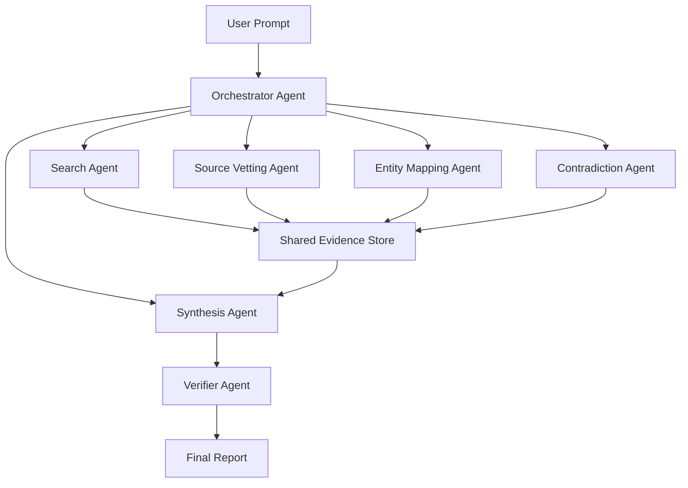

# Agent Swarm Architecture

## Executive Summary

An **agent swarm** architecture is a system where multiple specialized AI agents work on the same investigation in parallel, coordinated by an orchestrator. Instead of one model doing all planning, searching, analysis, and writing in a single loop, the work is split across agents with narrower responsibilities.

The promise of a swarm is better coverage, deeper research, and more adversarial reasoning. The cost is much higher complexity: more tokens, more orchestration, more failure modes, and more need for structured shared state.

For this project, an agent swarm is best understood as a **later-stage architecture** that only becomes valuable once there is already a strong evidence store, clear task decomposition, and a verifier layer.

## What "Agent Swarm" Means

In practice, a swarm usually has:

- one **orchestrator** that plans and assigns work
- several **worker agents** with specific roles
- one **shared memory or artifact layer**
- one **critic / verifier** that checks the result

The key idea is not "many models" by itself. The key idea is:

- parallelism
- specialization
- controlled aggregation

## Basic Shape

## Core Components

### 1. Orchestrator

The orchestrator is the control plane. It does not do all the research itself. Its job is to:

- understand the investigation goal
- break the work into subtasks
- assign tasks to workers
- monitor progress
- detect missing coverage
- decide when to launch another pass
- decide when the report is ready for verification

This agent is closest to a research editor or assignment desk.

### 2. Specialist Workers

Each worker has a constrained role. Example workers for an investigative system:

- **Search agent**: expands queries, finds candidate sources
- **Scrape / extraction agent**: turns URLs into structured notes
- **Source vetting agent**: scores source quality and provenance
- **Entity agent**: maps people, organizations, regulators, subsidiaries
- **Timeline agent**: reconstructs chronology and key inflection points
- **Contradiction agent**: looks for disconfirming evidence
- **Hypothesis agent**: develops and updates possible explanations
- **Synthesis agent**: converts artifacts into a coherent draft

The goal is to keep each worker narrow enough that it can be evaluated and replaced independently.

### 3. Shared State

A swarm only works if agents share a durable, structured state. Otherwise it becomes many chat threads shouting into the void.

Typical shared artifacts include:

- investigation brief
- task queue
- evidence records
- extracted claims
- entity graph
- timeline
- hypothesis board
- open questions
- source reliability assessments

This is the most important part of the architecture. Without it, a swarm often performs worse than a single well-designed pipeline.

### 4. Verifier / Critic

A swarm needs an explicit final checker because multiple workers can easily amplify each other's mistakes. The verifier should check:

- unsupported claims
- duplicate or circular evidence
- low-quality source dependence
- unresolved contradictions
- confidence inflation
- broken citations

## How a Swarm Usually Operates

### Step 1: Build a brief

The orchestrator converts the user request into a research brief:

- scope
- target geography
- key actors
- hypotheses to test
- search lanes
- completion criteria

### Step 2: Fan out work

The orchestrator launches workers in parallel. Example:

- Search agent explores mainstream and niche search lanes
- Entity agent builds a stakeholder map
- Timeline agent reconstructs event order
- Contradiction agent begins searching for disconfirming evidence early

### Step 3: Write artifacts, not prose

Workers should write structured outputs into shared state, such as:

- `EvidenceRecord`
- `EntityRecord`
- `TimelineEvent`
- `HypothesisCard`

This prevents each worker from having to reread the whole conversation.

### Step 4: Re-plan

After the first pass, the orchestrator inspects gaps:

- Are sources too homogeneous?
- Are primary sources missing?
- Are local-language sources missing?
- Is a key hypothesis under-tested?
- Is the evidence mostly context, not proof?

It can then launch another wave of workers.

### Step 5: Synthesize and verify

A synthesis agent drafts the report from the artifacts. A separate verifier then tries to break it before release.

## Example Role Split for TrueMotives

If this project ever moved to a swarm, a realistic split could be:

### Orchestrator

- owns the research brief
- decides what sub-agents to launch
- tracks completion criteria

### Retrieval lane agents

- one for general web search
- one for news and media
- one for official documents and reports
- one for datasets or event feeds like GDELT

### Analysis lane agents

- entity / stakeholder mapper
- incentive analyst
- chronology / timing analyst
- contradiction hunter

### Publishing lane agents

- draft writer
- evidence linker
- verifier

This is usually better than ten identical "research agents" because the decomposition is clearer.

## Advantages

### Better breadth

Parallel workers can cover more search space than a single agent loop.

### Better specialization

A narrow worker can be prompted, evaluated, and tuned for one job instead of trying to be universally good.

### Better adversarial reasoning

A dedicated contradiction or skeptic agent can push back on the main line of reasoning.

### Better throughput for hard investigations

When topics are broad, multi-stakeholder, or multilingual, a swarm can reduce wall-clock time while increasing coverage.

## Costs and Risks

### 1. Coordination overhead

The orchestrator has to assign, merge, deduplicate, and reconcile outputs. That is real architecture, not just prompting.

### 2. Token explosion

Parallel agents can burn a lot of tokens quickly, especially if they all read overlapping context.

### 3. Duplicate work

Without task boundaries and shared artifacts, multiple agents rediscover the same sources.

### 4. Error amplification

If one weak claim enters shared memory uncritically, several agents may build on it and make it look stronger than it is.

### 5. Harder debugging

A single-agent failure is easier to inspect. In a swarm, a bad report may come from:

- bad task decomposition
- bad worker prompts
- stale shared state
- merge errors
- verifier weakness

### 6. Higher product complexity

The UI, storage, observability, and evaluation story all become more demanding.

## Common Swarm Patterns

### Pattern 1: Hub-and-spoke

One orchestrator assigns tasks to workers and collects results.

Best when:

- tasks are clearly separable
- central control is important

### Pattern 2: Debate / adversarial pair

One agent makes the case, another tries to refute it.

Best when:

- correctness matters more than speed
- claims are interpretive or controversial

### Pattern 3: Pipeline swarm

Agents are specialized by stage, not topic:

- retrieve
- extract
- analyze
- synthesize
- verify

Best when:

- the workflow is repeatable
- artifacts are structured

### Pattern 4: Topic partitioning

Agents split the investigation by actor, region, or time period.

Best when:

- the topic is broad and decomposes naturally

For this product, **pipeline swarm** plus **adversarial verification** is likely the most sensible pattern.

## What Makes a Swarm Work Well

### Clear task contracts

Each worker needs:

- a bounded scope
- a required output schema
- completion criteria
- rules for uncertainty

### Durable structured artifacts

Agents should read and write compact structured state, not huge free-form transcripts.

### Source deduplication

The system needs URL canonicalization, source clustering, and duplicate detection.

### Evidence linking

Every downstream claim should point back to evidence IDs, not vague prose.

### Re-planning logic

The orchestrator must be able to say:

- "coverage is weak here"
- "launch another pass"
- "do not synthesize yet"

### Verification independence

The final checker should not simply restate the synthesis agent's opinion.

## When a Swarm Is the Right Choice

A swarm is worth it when:

- investigations are broad and multi-dimensional
- you need parallel coverage
- you can define specialized worker roles
- you have strong shared-state design
- higher cost is acceptable

## When a Swarm Is the Wrong Choice

A swarm is a bad fit when:

- the system still lacks basic evidence normalization
- phase logic is weak
- output schemas are too loose
- debugging and evaluation are immature
- the same effect could be achieved with a simpler multi-pass pipeline

That is why swarm architecture is often over-adopted too early.

## Recommendation for This Project

For TrueMotives, I would not make "agent swarm" the immediate next step. I would sequence it like this:

1. Build a research brief model.
2. Add structured evidence artifacts.
3. Add explicit contradiction and verification passes.
4. Turn the current single loop into a multi-pass orchestrated workflow.
5. Only then introduce selective parallel worker agents where the decomposition is obvious.

That gives you the benefits of methodical research first, and swarm parallelism second.

## A Good Future Swarm Shape for TrueMotives

If the platform matures into a swarm, I would aim for:

- one orchestrator
- a small number of specialist workers
- one shared evidence layer
- one independent verifier

Not:

- many generic researchers with overlapping prompts
- no evidence store
- no reconciliation layer

In other words, the right mental model is:

**editorial newsroom with a shared research desk**

not

**a crowd of autonomous bots improvising in parallel**

## Bottom Line

An agent swarm architecture can absolutely improve investigation depth and rigor, but only if it sits on top of strong research infrastructure:

- structured brief
- structured evidence
- controlled task decomposition
- explicit contradiction search
- independent verification

Without those pieces, a swarm usually increases cost and noise faster than it increases truthfulness.
