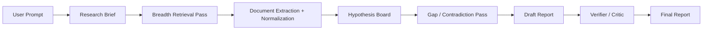

# Architecture Review: Investigation Agent

## Executive Summary

The current investigation system has solid foundations, but today it behaves more like a prompt-driven research assistant than a methodical research engine. The biggest quality limiter is not missing tools. It is that planning, retrieval, analysis, skepticism, and report writing all happen inside one `DurableAgent` loop with very little explicit research state or verification.

For the goal of more thorough, methodical, higher-quality reports, I would **not** jump straight to a swarm of agents. The highest-ROI next step is a **workflow-orchestrated, multi-pass research pipeline** with persistent evidence artifacts, explicit phase gates, and a final critic/verifier pass. That will burn more tokens, but it will spend them on structured reasoning instead of repeatedly stuffing raw search/scrape output back into the same chat context.

## Scope Reviewed

- `server/investigations/planning.ts`
- `server/investigations/planning-prompt.ts`
- `server/workflows/investigation/workflow.ts`
- `server/workflows/investigation/prompts.ts`
- `server/workflows/investigation/tools.ts`
- `server/workflows/investigation/steps/research.ts`
- `server/workflows/investigation/phase-tracking.ts`
- `server/integrations/brave-search.ts`
- `server/integrations/firecrawl.ts`
- `server/integrations/gdelt.ts`
- `server/integrations/newsapi.ts`
- `shared/investigations/schema.ts`
- `shared/report-schema.ts`
- `server/workflows/investigation/__tests__/workflow.test.ts`
- `client/hooks/use-investigation-stream.ts`

## Current Architecture

### 1. Planning

The system first converts a freeform user prompt into a structured investigation input using `gpt-5.4-nano` in `server/investigations/planning.ts`. The planner outputs:

- title
- description
- category
- geography
- report language
- 3-6 high-level phases

This is useful, but the output is still thin. It does **not** create an operational research plan with hypotheses, key entities, source requirements, search families, stop conditions, or confidence criteria.

### 2. Execution

`server/workflows/investigation/workflow.ts` runs a single `DurableAgent` using `gpt-5.4` with:

- one system prompt
- one user prompt
- one shared tool set
- `maxSteps = 60`
- one final structured report schema

That single loop is responsible for:

- deciding what to research
- deciding which tools to call
- deciding when enough evidence exists
- synthesizing findings
- assigning confidence
- drafting the final report

### 3. Tools and Retrieval

The tool layer is a thin wrapper around external systems:

- Brave web search
- Firecrawl search
- Firecrawl scrape
- GDELT media events
- NewsAPI top headlines / everything / sources

This gives the model breadth, but the results come back mostly as raw API payloads or raw scraped content. There is no durable normalized evidence layer between retrieval and synthesis.

### 4. Progress Tracking

The UI shows phases and activity logs, but phase progression is heuristic. `server/workflows/investigation/phase-tracking.ts` advances phases based on research tool call counts, not on semantic completion. In practice, phases are mostly a progress illusion for the user, not a control mechanism for the system.

### 5. Output

The final output is schema-constrained, which is good. But `shared/report-schema.ts` is a presentation schema, not a research schema. It lacks explicit links between:

- motivations and evidence
- stakeholders and evidence
- confidence values and supporting rationale
- claims and contradictory evidence

## What Is Good Already

- The split between planning and execution is a good start.
- Using Workflow DevKit and `DurableAgent` gives you resumability, step isolation, and streaming support.
- Step-level tools with progress emission are a good operational pattern.
- The final report schema creates consistent output shape.
- The system already has multiple research surfaces, which is better than relying on a single search API.
- The UI stream architecture can support richer progress and state if the backend becomes more explicit.

## Architectural Issues Limiting Research Quality

### 1. The system has phases, but not a real research state machine

The planner generates phases, but execution does not meaningfully enforce them. The agent is merely reminded about the phases in the prompt, and the backend advances the UI based on tool-call buckets. This means:

- phases do not constrain tool access
- phases do not define exit criteria
- phases do not produce artifacts
- phases do not prevent the agent from skipping important work

This is the clearest sign that the architecture is still prompt-led rather than process-led.

### 2. One agent loop is carrying too many concerns

The single `DurableAgent.stream()` call in `server/workflows/investigation/workflow.ts` is doing planning, retrieval strategy, sensemaking, skeptical reasoning, and final authorship in one conversation. That creates several problems:

- the model can lose track of what has already been proven vs merely suggested
- context fills with raw tool output instead of curated research memory
- there is no forced contradiction pass before synthesis
- there is no independent verification layer

This is the main reason output quality will plateau even if you raise `maxSteps` or upgrade the prompt.

### 3. There is no first-class evidence store

Today the agent sees tool outputs in its message history, then emits a report. There is no canonical artifact model for:

- documents
- snippets
- claims
- source metadata
- entities
- hypotheses
- unresolved questions

Without this layer, the system cannot be truly methodical. It cannot reliably answer:

- Which claims are supported by independent sources?
- Which motivations have contradictory evidence?
- Which hypotheses are still open?
- Which source families are underrepresented?

### 4. The current prompt is skeptical, but not evidence-calibrated

`server/workflows/investigation/prompts.ts` strongly encourages contrarian and "conspiracy-adjacent" exploration. That may increase recall for non-obvious angles, but it also creates a structural bias toward provocative hypotheses. For a platform that wants better investigative quality, skepticism should be encoded as **method**, not just tone.

The current prompt does not adequately force the model to:

- separate observed facts from inferences
- collect disconfirming evidence
- downgrade weak theories when evidence is thin
- explain confidence as a function of source quality and corroboration

### 5. Raw retrieval is not converted into compact, reusable memory

Firecrawl can return large markdown blobs. Search APIs return broad result sets. The current architecture relies on the model to consume those results inline. That is expensive and brittle:

- tokens are spent re-reading raw retrieval output
- important evidence can be forgotten later in the run
- duplicate documents are not clustered
- the same source may be rediscovered several times

This is a classic "chat context as database" anti-pattern.

### 6. The report schema is too presentation-oriented for rigorous investigations

A few examples from `shared/report-schema.ts`:

- `motivations[].supportingEvidence` is free text, not references to actual evidence records
- `evidence[]` has no quote, publication date, source type, or corroboration count
- there is no field for counter-evidence per motivation
- there is no methodology section explaining how the system reached the conclusion

This makes the final report readable, but not auditable.

### 7. There is no explicit coverage, diversity, or stop-condition logic

The system currently has no architectural guardrails such as:

- minimum number of independent domains
- minimum number of primary sources
- required contradiction search before final synthesis
- required local-language retrieval for non-English geographies
- "insufficient evidence" gates

As a result, the agent can produce a complete-looking report before the research is actually complete.

### 8. Testing is operational, not epistemic

The current tests are good smoke tests for provider integration and stream behavior, but they do not evaluate research quality. There are no tests or evals for:

- source diversity
- citation validity
- unsupported claims
- contradiction coverage
- confidence calibration
- phase adherence

For this kind of system, quality regressions will often be epistemic rather than syntactic.

## Recommended Direction

### Move from "single research chat" to "research workflow with artifacts"

I recommend evolving the architecture into an orchestrated pipeline with explicit intermediate products. The important shift is:

- from: one agent that researches and writes
- to: one workflow that manages research passes, evidence state, and verification

This can still use `DurableAgent`, but it should be used in **multiple controlled passes**, not as one monolithic loop.

### Recommended target flow



## Proposed Architecture

### 1. Research Brief Generator

Upgrade the planner from a UI convenience step into a real brief generator. The brief should include:

- investigation title and scope
- key actors / entities
- official explanation
- initial alternative hypotheses
- key unknowns
- source quotas
- geographic and language requirements
- explicit research passes
- completion criteria

This can still start from the current planner, but `gpt-5.4-nano` is likely too weak for complex investigations. I would move planning to a stronger model tier for non-trivial prompts.

### 2. Orchestrated Multi-Pass Workflow

Instead of one `agent.stream()` call, run several passes with explicit responsibilities:

1. Briefing pass
2. Breadth search pass
3. Focused deep-dive pass
4. Contradiction / disconfirmation pass
5. Synthesis pass
6. Verification pass

Each pass should write structured artifacts, not just natural-language progress.

### 3. Evidence Store

Introduce a canonical evidence layer. At minimum, store records like:

```ts
type EvidenceRecord = {
  id: string;
  url: string;
  sourceTitle: string;
  sourceType: 'primary' | 'news' | 'analysis' | 'dataset' | 'official';
  publishedAt?: string;
  language?: string;
  excerpt: string;
  summary: string;
  stance: 'supports' | 'contradicts' | 'context';
  reliability: 'high' | 'medium' | 'low';
};

type HypothesisCard = {
  id: string;
  statement: string;
  supportIds: string[];
  contradictionIds: string[];
  openQuestions: string[];
  confidence: 'high' | 'medium' | 'low';
};
```

This is the missing backbone for methodical reasoning.

### 4. Hypothesis Board Instead of Free-Form Skepticism

Have the system explicitly track:

- the official narrative
- competing explanations
- what supports each explanation
- what contradicts each explanation
- what remains unknown

That turns skepticism into a disciplined comparison process. The report then becomes the output of the board, not the first place where thinking is forced into structure.

### 5. Critic / Verifier Pass

Before finalizing the report, run a dedicated verification pass that checks:

- every major claim maps to evidence
- every motivation has at least one supporting and one attempted contradictory check
- speculative claims are labeled as speculative
- citation URLs resolve and match the claim type
- source diversity thresholds are met

This can be implemented as a separate model call over the structured artifacts. It should be allowed to reject the draft and reopen research gaps.

### 6. Dynamic Tool Gating and Model Switching

The current code uses a single model and a single tool set for the whole run, even though Workflow DevKit supports `prepareStep`, `activeTools`, and phase-aware control. Use that.

Examples:

- early pass: only search tools
- deep-dive pass: enable scraping
- synthesis pass: disable tools entirely
- cheap model: query generation, clustering, artifact extraction
- strong model: contradiction analysis, final synthesis, verifier

This is one of the easiest ways to improve quality while keeping token usage intentional.

### 7. Upgrade the Output Schema for Auditability

Evolve `shared/report-schema.ts` so the report is backed by evidence references instead of loose prose. Recommended changes:

- add stable `id` fields to evidence and motivations
- replace `supportingEvidence: string[]` with `evidenceRefs: string[]`
- add `counterEvidenceRefs: string[]`
- add `confidenceRationale`
- add `sourceType`, `publishedAt`, and optional `excerpt` to evidence
- add a `methodology` section

The end result should let a reader trace every major conclusion back to the research artifacts.

## What I Would Not Do Yet

- I would not start with a large autonomous agent swarm.
- I would not rely on prompt tuning alone.
- I would not add many new search providers before adding evidence normalization.
- I would not increase `maxSteps` and hope quality improves on its own.

Those changes increase complexity or cost without fixing the core architectural bottleneck.

## Incremental Implementation Plan

### Phase 1: Highest ROI

- Add a richer `ResearchBrief` object to planning output.
- Replace heuristic phase completion with explicit workflow phases and exit criteria.
- Add a structured evidence artifact layer.
- Add a dedicated verifier pass before report finalization.
- Update the report schema to reference evidence records.

### Phase 2: Depth and Coverage

- Add source diversity quotas and coverage gates.
- Add contradiction-search requirements.
- Add local-language query generation for non-English topics.
- Add deduplication / source clustering so the agent does not overfit one domain family.
- Summarize and compress document content into reusable research memory.

### Phase 3: Advanced Depth

- Add optional angle-specific workers only after the evidence store exists.
- Add human-editor checkpoints for high-risk investigations.
- Add offline eval suites and benchmark topics.
- Add investigation replay and artifact inspection for debugging.

## Expected Token Impact

This architecture will cost more tokens, but in a better way.

- Planning and verification passes will add overhead.
- Evidence extraction and contradiction analysis will add more model calls.
- However, normalized artifacts should reduce waste from repeatedly re-reading raw markdown and search payloads.

Net result: I would expect total token usage to increase, but quality per token should improve substantially because the system is spending tokens on structured reasoning rather than on chat-history sprawl.

## Metrics To Track

- Average number of distinct source domains per report
- Primary-source ratio
- Number of hypotheses explicitly contradicted before finalization
- Unsupported-claim rate in final reports
- Citation resolution rate
- Percentage of motivations with direct evidence references
- Human usefulness score from editorial review
- Average number of open questions carried into limitations

## Bottom Line

The current architecture is a good prototype, but it is still fundamentally a **single-agent report generator with tools**. If the goal is higher-quality investigative work, the system needs to become a **research operating system**:

- explicit brief
- explicit evidence artifacts
- explicit hypothesis tracking
- explicit contradiction search
- explicit verification before publication

That is the architectural move most likely to improve report quality in a durable way.
